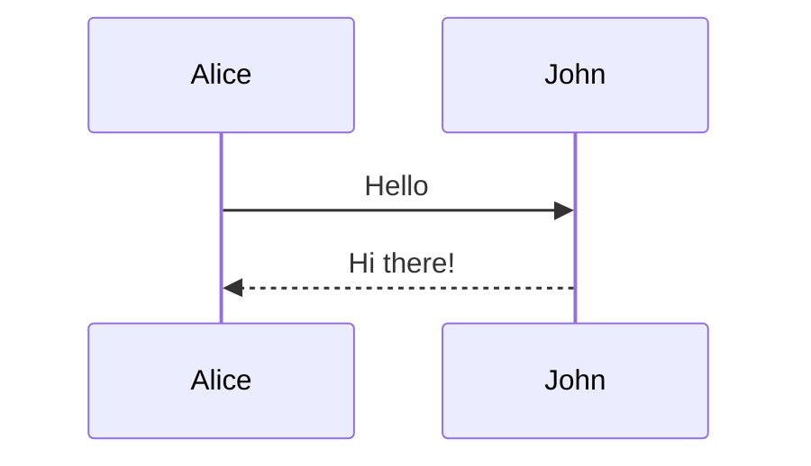

# InkForge

A high-performance Markdown to Image conversion service. Convert Markdown documents into beautiful images with syntax highlighting, math equations, and diagrams.

## Features

- **Markdown to Image** - Convert to PNG, JPEG, or WebP
- **LaTeX Math** - `$E=mc^2$`, `$$\int_0^\infty$$`, etc.
- **Syntax Highlighting** - Python, JavaScript, Go, Bash, and more
- **Mermaid Diagrams** - Flowcharts, sequence diagrams, etc.
- **Themes** - Light and dark mode
- **High DPI** - Retina-quality output

## Quick Start

### Docker (Recommended)

```bash
# Run container
docker run -d -p 8080:8080 inkforge

# Open browser
http://localhost:8080
```

### From Source

```bash
go build -o inkforge ./cmd/inkforge/
./inkforge
```

## Usage

### API Endpoint

```
POST /api/v1/markdown2image
```

Returns the image directly.

### cURL Examples

**Simplest:**
```bash
curl -X POST http://localhost:8080/api/v1/markdown2image \
  -H "Content-Type: application/json" \
  -d '{"content": "# Hello World"}' \
  -o image.jpg
```

**With Math + Code + Diagram:**
```bash
curl -X POST http://localhost:8080/api/v1/markdown2image \
  -H "Content-Type: application/json" \
  -d '{
    "content": "# Math Example\n\n$E=mc^2$\n\n$$\\frac{-b \\pm \\sqrt{b^2-4ac}}{2a}$$\n\n## Code\n\n```python\nprint(\"Hello\")\n```\n\n## Diagram\n\n```mermaid\ngraph TD\nA --> B\n```",
    "theme": "dark",
    "width": 800
  }' \
  -o output.png
```

**Python Example:**
```python
import requests

response = requests.post(
    "http://localhost:8080/api/v1/markdown2image",
    json={
        "content": "# Hello\n\n**Bold** and *italic*",
        "theme": "light",
        "width": 600
    }
)

with open("output.jpg", "wb") as f:
    f.write(response.content)
```

## Parameters

| Parameter | Default | Description |
|-----------|---------|-------------|
| content | (required) | Markdown text |
| theme | "light" | "light" or "dark" |
| image_format | "jpg" | "jpg", "png", "webp" |
| width | 1200 | Image width (pixels) |
| height | 800 | Image height (pixels) |
| scale | 2.0 | DPI scale (2.0 = retina) |
| quality | 90 | JPEG quality (1-100) |

## Examples

### Math

```markdown
Inline: $E=mc^2$

Display: $$\int_0^\infty e^{-x^2} dx = \frac{\sqrt{\pi}}{2}$$
```

### Code

````markdown
```python
def fib(n):
    if n <= 1:
        return n
    return fib(n-1) + fib(n-2)
```
````

### Diagram

````markdown

````

## Health Check

```bash
curl http://localhost:8080/api/v1/health
```

## License

MIT
