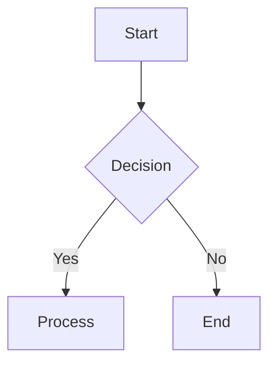

# InkForge

InkForge is a high-performance Markdown rendering engine designed for developers and AI systems. It converts Markdown content into high-quality image outputs with full support for standard Markdown syntax, LaTeX mathematical expressions (powered by KaTeX), syntax highlighting (powered by Prism), and Mermaid diagrams.

Built on a browser-level rendering pipeline using Playwright, InkForge ensures consistent layout, pixel-perfect output, and cross-platform compatibility.

## Features

- **Markdown to Image** - Convert Markdown to PNG, JPEG, or WebP
- **LaTeX Math** - Full support for inline and display math equations using KaTeX
- **Syntax Highlighting** - Code blocks with syntax highlighting (Python, JavaScript, TypeScript, Go, Bash, etc.)
- **Mermaid Diagrams** - Flowcharts, sequence diagrams, and more
- **Theme Support** - Light and dark themes
- **High Resolution** - Configurable scale factor for retina-quality output
- **API-First** - Easy integration via REST API

## Quick Start

### Run with Docker

```bash
docker run -d -p 8080:8080 insmtx/inkforge
```

### Run from Source

```bash
# Install dependencies
go mod download

# Build
go build -o inkforge ./cmd/inkforge/

# Run
./inkforge
```

The server will start at `http://localhost:8080`

## Demo

Open `http://localhost:8080` in your browser to access the interactive demo page.

## API Usage

### Convert Markdown to Image

**Endpoint:** `POST /api/v1/markdown2image`

Returns the image directly with `Content-Type: image/jpeg` (or png/webp based on format).

**Minimal Request (content only):**

```json
{
  "content": "# Hello World\n\nThis is **bold** text."
}
```

**Full Request (all optional parameters):**

```json
{
  "content": "# Hello World\n\nThis is **bold** and *italic* text.",
  "title": "My Document",
  "theme": "light",
  "image_format": "jpg",
  "width": 1200,
  "height": 800,
  "scale": 2.0,
  "quality": 90,
  "css": ""
}
```

### cURL Examples

**Minimal:**
```bash
curl -X POST http://localhost:8080/api/v1/markdown2image \
  -H "Content-Type: application/json" \
  -d '{"content": "# Hello\n\n$E=mc^2$"}' \
  -o output.jpg
```

**With options:**
```bash
curl -X POST http://localhost:8080/api/v1/markdown2image \
  -H "Content-Type: application/json" \
  -d '{
    "content": "# Hello\n\n```python\nprint(\"hi\")\n```",
    "theme": "dark",
    "width": 800
  }' \
  -o output.png
```

### Generate HTML (Debug)

**Endpoint:** `POST /api/v1/generatehtml`

Returns the generated HTML for debugging purposes.

### Health Check

**Endpoint:** `GET /api/v1/health`

Returns `{"status": "ok"}` when the service is running.

## Request Parameters

| Parameter | Type | Default | Description |
|-----------|------|---------|-------------|
| content | string | (required) | Markdown content to convert |
| title | string | "" | Document title |
| theme | string | "light" | Theme: "light" or "dark" |
| image_format | string | "jpg" | Output format: "jpg", "png", "webp" |
| width | int | 1200 | Image width in pixels |
| height | int | 800 | Image height in pixels |
| scale | float | 2.0 | Scale factor for high-DPI (2.0 = 2x) |
| quality | int | 90 | JPEG/WebP quality (1-100) |
| css | string | "" | Custom CSS styles |

## Supported Markdown Features

### Code Blocks

````markdown
```python
def hello():
    print("Hello!")
```
````

Supported languages: Python, JavaScript, TypeScript, Go, Bash, JSON, and more.

### Math Equations

Inline: `$E=mc^2$`

Display:
```
$$
\int_0^\infty e^{-x^2} dx = \frac{\sqrt{\pi}}{2}
$$
```

### Mermaid Diagrams

````markdown

````

### Tables

````markdown
| Column 1 | Column 2 |
|----------|----------|
| Cell 1   | Cell 2   |
````

## Architecture

- **Gin** - Web framework
- **Playwright** - Browser-based rendering
- **KaTeX** - LaTeX math rendering
- **Prism** - Syntax highlighting
- **Mermaid** - Diagram rendering
- **gomarkdown** - Markdown parsing

## License

MIT License - see LICENSE file for details.
